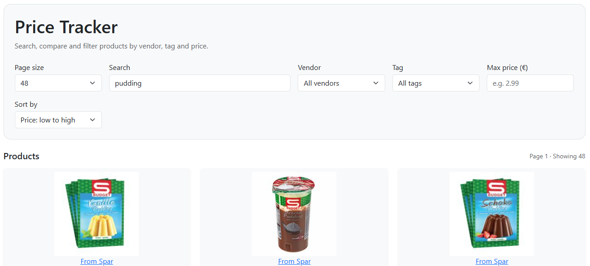

# price-tracker
Lets you inspect, filter and search the prices of the austrian store "SPAR".

## [Try it yourself!](http://draaal.crabdance.com/)

## Features
- See details about every product SPAR offers (Name, brand, vendor, amount, price, reference price, image)
- Vegan/vegetarian/no-lactose/... tags for some products
- Filter by name, brand, vendor (only SPAR currently), tags and max price
- Sort asc or desc by price and name and reference price
- pages with variable page size
- (Upcoming) Products from more stores hopefully soon!

## Run locally
1. Install Docker: [Windows](https://docs.docker.com/desktop/setup/install/windows-install/) [Linux](https://docs.docker.com/engine/install/) [Mac](https://docs.docker.com/desktop/setup/install/mac-install/)
2. Make sure the Docker engine is running
1. Clone the repo `git clone https://github.com/andraaal/price-tracker.git`
    - (Optional) Change the default postgres credentials in `docker-compose.yml`, `docker-compose.prod.yml` and `/backend/.env`. They need to match
2. cd into the folder and run it with `docker compose up`
    - This might take a while, since it downloads postgres, rust and node + all dependencies
    - You can also run the prod version of it with `docker compose -f docker-compose.prod.yml up`.
4. Open it on `localhost:5173` in the browser of your choice

## Technology
Consists of three separate docker containers:
- postgres container: Hosts a Postgres DB and exposes it over port 3000
- backend container does web-scraping with the awesome `reqwest` library. Uses `sqlx` to connect to Postgres and `dotenvy` for env variables. `Axum` is the server library that exposes the api for the frontend
- frontend container: Nginx server that hosts a `React` webpage that consumes the api and tries to present it in a nice way

I chose to use this double server setup, because at the beginning I wasn't really sure what I wanted to do and the web UI was more of a afterthought after the other part was finished
